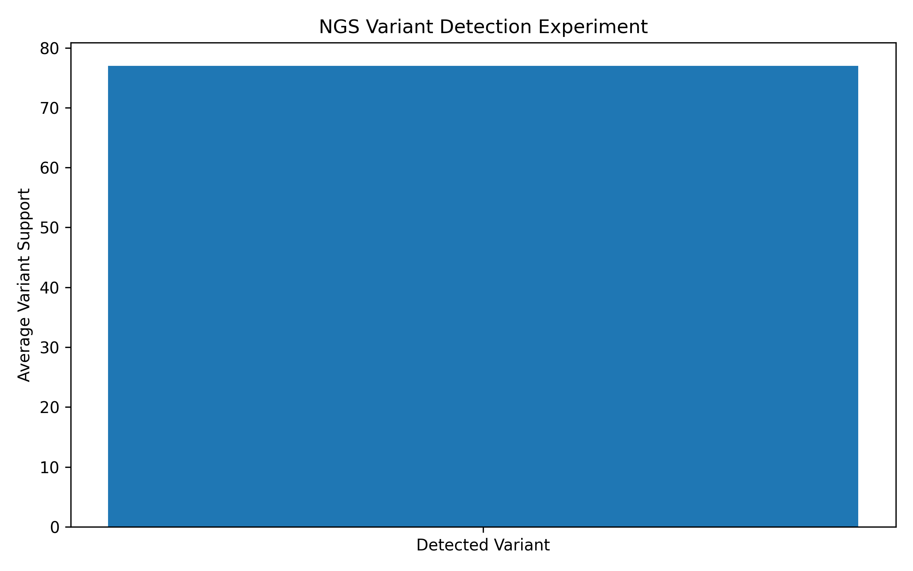

# Forensic NGS Analysis Lab

Educational bioinformatics project for exploring next-generation sequencing (NGS) workflows and forensic genomics.

## Overview

Next-generation sequencing (NGS) has become an important technology in modern genomics, enabling large-scale DNA analysis, variant discovery, and forensic applications.

This project simulates core steps of an NGS analysis workflow using Python, including sequencing read generation, quality assessment, variant detection, and experimental evaluation.

The framework provides an educational introduction to bioinformatics concepts commonly used in genomic and forensic laboratories.

---

## Scientific Motivation

NGS technologies are increasingly used in:

* Forensic genomics
* Human identification
* Missing persons investigations
* Disaster victim identification
* Population genetics
* Medical genomics
* Variant discovery

This project demonstrates simplified computational approaches for processing sequencing data and identifying genetic variation.

---

## FASTQ Simulation

The project generates synthetic sequencing reads in FASTQ format.

Example FASTQ structure:

```text
@read_0
ACGTACGTACGTACGT
+
IIIIIIIIIIIIIIII
```

Each read contains:

* Read identifier
* DNA sequence
* Separator line
* Quality score string

---

## Quality Control

Sequencing quality is assessed using simplified Phred quality scores.

Example result:

| Metric                | Value |
| --------------------- | ----- |
| Average Phred Quality | 40.0  |

High-quality sequencing data improves confidence in downstream variant detection.

---

## Variant Calling

The project implements a simplified variant calling approach.

A known SNP variant is introduced into a reference sequence and sequencing reads are generated from the modified genome.

The variant caller compares sequencing reads to the reference sequence and counts observed nucleotide differences.

Example detected variant:

```text
(20, 'A', 'T') count = 99
```

This indicates strong support for a true SNP at position 20.

---

## NGS Variant Detection Experiment

The experiment evaluates how consistently a simulated SNP variant can be detected across multiple sequencing runs.



Example result:

| Metric                  | Value |
| ----------------------- | ----- |
| Average Variant Support | 77.01 |

Results demonstrate reliable detection of true variants despite sequencing noise and random sampling effects.

---

## Key Results

| Analysis                | Result     |
| ----------------------- | ---------- |
| Average Phred Quality   | 40.0       |
| Average Variant Support | 77.01      |
| Variant Detection       | Successful |

The experiment demonstrates that true variants can be reliably detected despite sequencing noise introduced during read generation.

---

## Research Questions

1. How does sequencing quality affect variant detection?
2. How do sequencing errors influence forensic interpretation?
3. How can NGS support forensic genomics?
4. How can variant calling be simulated computationally?
5. How can sequencing noise be distinguished from true genetic variation?

---

## Methods

* FASTQ simulation
* DNA read generation
* Sequencing error simulation
* Phred quality assessment
* Variant calling
* SNP detection
* Monte Carlo experiments
* Data visualization using Python

---

## Project Structure

```text
forensic-ngs-analysis-lab/
│
├── reports/
│   ├── ngs_experiment.png
│   └── ngs_results.csv
│
├── src/
│   ├── fastq_simulator.py
│   ├── quality_control.py
│   ├── variant_calling.py
│   ├── ngs_experiment.py
│   └── plot_ngs_results.py
│
├── data/
├── notebooks/
├── tests/
│
├── requirements.txt
└── README.md
```

---

## Reproducibility

Install dependencies:

```bash
pip install -r requirements.txt
```

Run analyses:

```bash
python src/fastq_simulator.py
python src/quality_control.py
python src/variant_calling.py
python src/ngs_experiment.py
```

Generate visualization:

```bash
python src/plot_ngs_results.py
```

---

## Future Work

* Paired-end sequencing simulation
* Read alignment algorithms
* Coverage analysis
* VCF generation
* Multiple SNP detection
* INDEL simulation
* Population variant frequencies
* Forensic ancestry inference
* Advanced NGS workflows

---

## Disclaimer

This project is intended for educational and research-training purposes only.

It is not validated for forensic casework and must not be used in real investigations.

---

## Author

Agata Gabara
